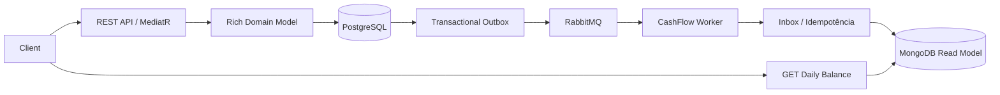

# Cash Flow Challenge

Sistema de fluxo de caixa construído com .NET 10, Clean Architecture, DDD, CQRS e processamento assíncrono resiliente. O sistema foi desenvolvido tendo em vista uma simplicidade no mvp porem focado em demostrar varias ferramentas, frameworks e serviços. Com o proposito de demostrar alguns dos conhecimentos adquiridos ao longo da carreira profissional.

## Arquitetura



PostgreSQL é a fonte da verdade. MongoDB é uma projeção descartável e reconstruível. API e Worker pertencem ao mesmo domínio `CashFlow`, mas são separados operacionalmente para que a indisponibilidade da consolidação não impeça novos lançamentos.

## Pré-requisitos

- Docker Desktop com Docker Compose; ou
- SDK .NET 10 para desenvolvimento sem containers.

O SDK utilizado pelo repositório está fixado em `global.json`.

## Executar com Docker

Opcionalmente, copie `.env.example` para `.env` e altere as credenciais locais.

```bash
docker compose up --build -d
```

Serviços disponíveis:

| Serviço | Endereço |
|---|---|
| API | `http://localhost:8080` |
| Documentação interativa (Scalar) | `http://localhost:8080/docs` |
| Contrato OpenAPI JSON | `http://localhost:8080/openapi/v1.json` |
| PostgreSQL | `localhost:5432` |
| MongoDB | `localhost:27017` |
| RabbitMQ | `localhost:5672` |
| RabbitMQ Management | `http://localhost:15672` |

Verificação básica da API:

```bash
curl http://localhost:8080/health
```

O health check verifica PostgreSQL, MongoDB e RabbitMQ e retorna `503` quando alguma dependência está indisponível.

Criação de um lançamento:

```bash
curl -X POST http://localhost:8080/api/v1/cash-entries \
  -H "Content-Type: application/json" \
  -d '{"type":"credit","amount":150.50,"description":"Product sale","occurredAt":"2026-08-27T14:30:00-03:00"}'
```

`description` é obrigatória, tem entre 3 e 200 caracteres e é normalizada removendo espaços no início e no final.

## Endpoints

| Método | Rota | Descrição |
|---|---|---|
| POST | `/api/v1/cash-entries` | Registra crédito ou débito |
| GET | `/api/v1/cash-entries/{id}` | Consulta um lançamento |
| GET | `/api/v1/cash-entries?page=1&pageSize=20&type=credit` | Lista lançamentos paginados |
| GET | `/api/v1/daily-balances/{date}` | Consulta consolidado em `yyyy-MM-dd` |
| GET | `/health` | Saúde das dependências |

Para encerrar os serviços preservando os dados:

```bash
docker compose down
```

## Executar localmente

Inicie a infraestrutura e, em terminais separados, execute:

```bash
docker compose up -d postgres mongo mongo-init rabbitmq
dotnet run --project src/CashFlow.Api
dotnet run --project src/CashFlow.Worker
```

## Compilar e testar

```bash
dotnet restore
dotnet tool restore
dotnet build --no-restore
dotnet test --no-build
```

## Migrations

A API aplica migrations automaticamente no ambiente de desenvolvimento. Para gerenciá-las manualmente:

```bash
dotnet tool restore
dotnet tool run dotnet-ef database update \
  --project src/CashFlow.Infrastructure \
  --startup-project src/CashFlow.Api
```

Testes de integração utilizam PostgreSQL e MongoDB reais via Testcontainers e exigem Docker em execução.

## Teste de carga

Com a aplicação no ar, execute k6 via Docker:

```bash
docker run --rm -i grafana/k6 run -e BASE_URL=http://host.docker.internal:8080 - < performance/k6/cash-entries.js
```

O cenário envia 50 requisições por segundo durante 60 segundos e exige erro abaixo de 5%, p95 abaixo de 500 ms e p99 abaixo de 1 segundo. Falha HTTP é diferente do atraso esperado da consistência eventual.

Última evidência local registrada: 3.000 requisições em 60 segundos, 0% de erro, p95 de 5,69 ms e p99 de 7 ms. Os números variam conforme a máquina; os thresholds do script são o critério reproduzível.

## Estrutura

```text
src/
├── CashFlow.Domain
├── CashFlow.Application
├── CashFlow.Infrastructure
├── CashFlow.Api
├── CashFlow.Worker
└── CashFlow.Contracts

tests/
├── CashFlow.Domain.Tests
├── CashFlow.Application.Tests
├── CashFlow.IntegrationTests
├── CashFlow.ArchitectureTests
└── CashFlow.EndToEndTests

performance/
└── k6/
```

## Infraestrutura local

- PostgreSQL é o write model e fonte da verdade.
- MongoDB é o read model e inicia como replica set de nó único para suportar transações da projeção e Inbox.
- RabbitMQ realiza a comunicação assíncrona entre escrita e consolidação.
- API e Worker possuem Dockerfiles multi-stage e executam como usuário não privilegiado.

## Transactional Outbox

Ao criar um lançamento, o mesmo `SaveChanges` do Entity Framework persiste:

```text
cash_entries + outbox_messages
```

O evento de domínio é convertido no contrato versionado `cash-entry.created.v1`. Seu payload contém o instante em UTC e a data contábil calculada no timezone configurável, cujo padrão é `America/Sao_Paulo`.

O Worker busca mensagens pendentes em batches com `FOR UPDATE SKIP LOCKED`, publica mensagens persistentes com publisher confirms e somente então preenche `processed_at_utc`. Falhas são registradas e reagendadas com backoff exponencial. A entrega é `at-least-once`; o consumidor é idempotente.

Topologia atual do RabbitMQ:

- exchange: `cashflow.events`;
- queue: `cashflow.daily-balance.v1`;
- routing key: `cash-entry.created.v1`;
- dead-letter exchange: `cashflow.dead-letter`;
- dead-letter queue: `cashflow.daily-balance.v1.dead-letter`.

As credenciais padrão são exclusivamente para desenvolvimento local. Não devem ser utilizadas em produção.

## Estado atual

Já estão disponíveis a fundação, o modelo de domínio, a criação de lançamentos, a persistência PostgreSQL, o Transactional Outbox, a publicação confirmada no RabbitMQ, o consumidor idempotente, a Inbox transacional e a projeção diária no MongoDB. A API oferece `POST /api/v1/cash-entries` e `GET /api/v1/daily-balances/{date}`.

O consolidado é eventualmente consistente: uma resposta `201 Created` confirma a gravação no PostgreSQL, mas a projeção pode levar um pequeno intervalo para refletir o lançamento. O Worker somente confirma a mensagem ao RabbitMQ depois do commit da transação que atualiza o saldo e registra o `EventId` na Inbox.

## Resiliência

Para demonstrar a independência da escrita:

```bash
docker compose stop cashflow-worker rabbitmq
# faça POSTs: eles continuam confirmados no PostgreSQL e pendentes no Outbox
docker compose start rabbitmq cashflow-worker
# o Outbox é drenado e o consolidado converge
```

Mensagens inválidas ou com versão desconhecida são enviadas à DLQ. Falhas transitórias no MongoDB não recebem ACK e são entregues novamente. O mesmo `EventId` não altera o saldo duas vezes.

## Trade-offs e limitações

- PostgreSQL + MongoDB deixam escrita e leitura adequadas a seus usos, ao custo de infraestrutura e consistência eventual.
- RabbitMQ desacopla a consolidação, mas exige observabilidade, Inbox e operação de DLQ.
- Outbox elimina a janela entre commit e publicação, ao custo de tabela, polling e limpeza futura.
- O replica set MongoDB de nó único é adequado apenas para desenvolvimento e testes; produção requer alta disponibilidade, TLS, autenticação e secrets externos.
- As credenciais padrão do `.env.example` são apenas locais. O arquivo `.env` não é versionado.
- Não há autenticação de usuários da API porque ela não faz parte do escopo do desafio.

## CI

O workflow `.github/workflows/ci.yml` executa restore, verificação de formatação, build e todos os testes em push e pull request.
